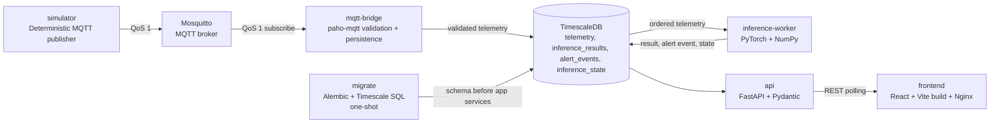

# Design Spec: Web IoT Anomaly Detection Platform

> **Created:** 15 Jul 2026  
> **Revision:** 19 Jul 2026  
> **Status:** Approved  
> **Scope:** One-laptop Docker Compose demo for simulated MQTT telemetry, PyTorch inference, historical audit, and operator dashboard

---

## 1. Status dan Tujuan

Dokumen ini tetap menjadi design authority untuk seluruh platform. Detail frontend, contract mock, urutan frontend-first, dan keputusan UI dikuasai oleh `docs/superpowers/specs/2026-07-19-frontend-first-design.md`; dokumen tersebut tidak mengubah authority arsitektur platform ini di luar scope frontend. Dokumen ini menggantikan arsitektur Laravel/Redis/ClickHouse/ONNX pada revision sebelumnya dan membuat implementation plan lama yang merujuk stack tersebut tidak berlaku sebagai panduan arsitektur.

### Goals

- Menjalankan seluruh demo pada satu laptop melalui Docker Compose.
- Menerima telemetry sensor simulasi melalui MQTT, menyimpan history yang dapat diaudit, dan menampilkan dashboard React.
- Menjalankan anomaly inference yang deterministik dari artifact PyTorch yang terversi.
- Menyediakan alert lifecycle yang dapat diaudit tanpa mengubah riwayat event.
- Mengutamakan reliability, restart safety, dan kemudahan demonstrasi skripsi dibanding scale-out production.

### Constraints

- Tidak ada login atau authorization pada scope ini; seluruh port host hanya boleh bind ke `127.0.0.1`.
- Semua komponen runtime berjalan sebagai container Docker, termasuk simulator MQTT.
- Frontend menggunakan TypeScript dan mendapatkan update melalui REST polling, bukan push connection.
- Telemetry, inference result, dan alert event disimpan di TimescaleDB untuk chart dan audit history.
- Model, preprocessing, dan threshold harus tersedia sebagai artifact yang kompatibel sebelum inference normal dinyatakan ready.

### In Scope

- Dashboard latest telemetry, historical charts, inference results, dan alert events/current status.
- Simulator deterministik, Mosquitto, MQTT bridge, database-driven inference worker, FastAPI, dan migrations.
- Acknowledge dan resolve alert sebagai immutable event.
- Health/readiness checks, observability operasional dasar, dan automated tests.

### Out of Scope

- Authentication, multi-user authorization, notification email/SMS/push, model upload UI, multi-tenant deployment, cloud orchestration, dan high-availability cluster.
- Streaming UI melalui SSE atau WebSocket.
- External metrics stack dan operational dashboards khusus.

### Acceptance Criteria

1. `docker compose up` menjalankan tujuh persistent container yang sehat dan satu migration service yang selesai sukses.
2. Telemetry QoS 1 dari simulator muncul sekali pada `telemetry`, dapat ditampilkan sebagai latest dan history, serta tetap tersedia setelah `mqtt-bridge` restart.
3. Inference memproses telemetry per device secara ordered, menghasilkan paling banyak satu `inference_results` row untuk kombinasi uniknya, dan tidak menduplikasi result/event setelah worker restart.
4. Alert detected, acknowledged, dan resolved tersimpan sebagai event immutable; current status yang dikembalikan API sesuai event terakhir setiap alert.
5. API `/ready` gagal hanya bila database atau migration dependency API tidak valid; healthcheck/readiness `inference-worker` gagal bila production artifact tidak valid, dan random score tidak pernah menjadi fallback implisit.
6. pytest, Vitest, dan Playwright membuktikan contract utama, termasuk restart/no-duplication path.

---

## 2. Final Technology Stack

| Area | Pilihan final | Peran |
|---|---|---|
| Frontend | React + Vite + TypeScript, MUI Core, MUI X Data Grid Community, Apache ECharts themed from MUI, React Router, TanStack Query, MSW untuk dev/test saja, Vitest, React Testing Library, Playwright, frontend Docker image, dan Nginx | Frontend-first deliverable mencakup SPA desktop yang disajikan Nginx, REST polling, chart interaktif, dan contract mock sebelum backend; Nginx memproxy endpoint data aplikasi relatif `/api` serta pengecualian root `/health` dan `/ready` ke FastAPI kemudian; Redux dan MUI X Charts tidak digunakan |
| API | FastAPI + Pydantic | REST contract, request validation, health/readiness |
| Data access | SQLAlchemy 2 + psycopg 3 | Query dan transaction PostgreSQL/TimescaleDB |
| Schema management | Alembic + Timescale-specific SQL | Base schema dan hypertable/index/policy setup |
| MQTT | Mosquitto + paho-mqtt | Broker dan subscription bridge/simulator |
| Inference | Native PyTorch + NumPy | Artifact loading, preprocessing, dan model evaluation |
| Database | TimescaleDB | Telemetry, inference, alert-event history, dan state cursor |
| Runtime | Docker Compose | Single-laptop orchestration |
| Tests | pytest, Vitest, Playwright | Backend/unit-integration, frontend unit, dan end-to-end browser |
| UI update | REST polling | Refresh latest data dan alert state tanpa persistent connection |

API, `mqtt-bridge`, dan `inference-worker` adalah container dan process yang terpisah. Ketiganya boleh memakai satu shared Python image untuk mengurangi build duplication, dengan command override per service; image bersama tidak berarti process digabungkan.

---

## 3. Architecture



### Containers

| Service | Lifecycle | Responsibility | Dependencies |
|---|---|---|---|
| `frontend` | Persistent | Serve built React SPA via Nginx; proxy application data requests at `/api` and root `/health` and `/ready` exceptions | No startup dependency for SPA serving. The Nginx container starts independently for frontend-first delivery; `/api`, `/health`, and `/ready` requests require FastAPI when the full stack is running. |
| `api` | Persistent | FastAPI REST surface; read/query data and append operator alert events | `migrate` completed, TimescaleDB healthy |
| `mosquitto` | Persistent | MQTT broker for simulator and bridge | None |
| `mqtt-bridge` | Persistent | Subscribe, validate, and idempotently persist telemetry | `mosquitto` healthy, `migrate` completed |
| `inference-worker` | Persistent | Ordered per-device inference, atomic persistence, dan artifact readiness sendiri | `migrate` completed, TimescaleDB healthy, artifacts valid |
| `simulator` | Persistent | Publish deterministic telemetry and controlled anomaly scenarios | `mosquitto` healthy |
| `timescaledb` | Persistent | PostgreSQL + TimescaleDB durable store | None |
| `migrate` | One-shot | Run Alembic then Timescale-specific SQL exactly once per deployment | `timescaledb` healthy |

Compose uses a private bridge network. Host-exposed frontend, API, and MQTT ports bind to `127.0.0.1`; database is not host-exposed. Compose healthchecks gate startup rather than relying only on process start order. `migrate` owns schema creation and upgrade; no other service runs migrations.

### Data Flow

The canonical path is:

`simulator -> Mosquitto -> mqtt-bridge -> TimescaleDB -> inference-worker -> TimescaleDB -> API -> frontend`

`mqtt-bridge` acknowledges the MQTT delivery only after validation and a successful idempotent database write. `inference-worker` reads TimescaleDB rather than an in-memory queue or cache, so processing can resume deterministically after a restart. The API reads TimescaleDB only; frontend polling does not contact MQTT or worker containers.

---

## 4. TimescaleDB Data Model

All timestamps are timezone-aware UTC `timestamptz`. Device identifiers are stable strings. Alembic defines relational columns and constraints; a versioned SQL migration calls `create_hypertable` and creates Timescale-specific indexes/policies.

| Table | Kind | Time partition and uniqueness | Purpose |
|---|---|---|---|
| `telemetry` | Hypertable | partitioned by `ts`; unique `(device_id, ts)` | Validated raw sensor readings |
| `inference_results` | Hypertable | partitioned by `window_end_ts`; unique `(device_id, window_end_ts, model_version)` | Score and decision per completed window |
| `alert_events` | Hypertable | partitioned by `event_ts`; unique `(event_id, event_ts)`; index `(alert_id, event_ts DESC)` | Immutable detected, acknowledged, and resolved lifecycle history |
| `inference_state` | Regular table | one row per device | Only mutable table; cursor and worker state |

### `telemetry`

Columns include `device_id`, `ts`, `temperature_c`, `relative_humidity_pct`, `event_id`, `correlation_id`, `received_at`, `payload_hash`, and `schema_version`. The unique key makes QoS 1 redelivery harmless. A second payload for the same `(device_id, ts)` with a different hash is rejected and logged as an integrity violation; it never overwrites historical telemetry.

### `inference_results`

Columns include `device_id`, `window_start_ts`, `window_end_ts`, `score`, `threshold`, `is_anomaly`, `model_version`, `model_hash`, `preprocessing_hash`, `threshold_hash`, `correlation_id`, and `created_at`. The result row records the exact model and artifact hashes used for the decision.

### `alert_events` and current status

Each row includes `event_id`, `alert_id`, `event_ts`, `event_type`, `device_id`, `inference_result_window_start_ts`, `inference_result_window_end_ts`, `inference_model_version`, `correlation_id`, `actor`, and optional `note`. `inference_model_version` is required for `detected` and null for operator lifecycle events. The hypertable has `UNIQUE (event_id, event_ts)` and index `(alert_id, event_ts DESC)`; the latter supports lifecycle lookup while retaining the time partition in the unique key.

- A threshold breach appends `detected` with a new stable `alert_id` and references the unique inference tuple `(device_id, inference_result_window_end_ts, inference_model_version)`; it also records that window's start timestamp.
- `acknowledged` and `resolved` append new rows for the same `alert_id`; they do not update the detected row.
- Current status is derived by selecting the latest event for each `alert_id` with deterministic order `event_ts DESC, event_id DESC`: `detected` means active, `acknowledged` means acknowledged, and `resolved` means resolved.
- An acknowledge/resolve command supplies one client-generated stable UUID `command_id` and timezone-aware `event_ts`; the API maps `command_id` directly to `alert_events.event_id`. Every retry preserves both values. Before reading current state and appending its event, the transaction takes a transaction-scoped advisory lock derived from `alert_id`.
- Transitions are validated while holding that lock: only an active alert can be acknowledged; only an acknowledged alert can be resolved; direct resolution from active is rejected; resolved alerts reject further lifecycle transitions. The unique key plus serialized state read means concurrent duplicate transitions accept at most one lifecycle event; a retry of the accepted command is an idempotent no-op.

There is deliberately no mutable `alerts.status` row. Event sourcing preserves who changed the alert, when it changed, and its prior state; it also avoids a restart or concurrent request silently replacing audit history.

### `inference_state`

`inference_state` has `device_id` as primary key and stores `last_processed_ts`, `last_window_end_ts`, `cadence_anchor_ts`, `model_version`, and `updated_at`. It is the sole mutable table because cursor advancement is operational state, not audit history.

### Identity and Correlation

The simulator emits deterministic fixture `event_id` and `correlation_id` values, derived from scenario/device/timestamp through UUIDv5 or supplied fixed fixtures; it does not use random UUIDv4. `event_id` identifies the published telemetry event. For a completed 30-reading window, `inference_results.correlation_id` is the correlation ID of its window-end telemetry, and a resulting `detected` alert event uses that same correlation ID plus `inference_model_version` to reference `(device_id, window_end_ts, model_version)` unambiguously while recording the window start/end timestamps. The frontend generates one stable UUID `command_id` and timezone-aware `event_ts` per acknowledge/resolve action, preserves them for retries, and the API maps `command_id` to `event_id`; tests may use fixed IDs/timestamps. Operator events carry the target `alert_id` and actor `local-operator`. This actor is local audit context, not an authenticated identity. These IDs are logged by bridge, worker, and API to make one demo event traceable end-to-end.

---

## 5. MQTT Contract and Ingestion Semantics

### Topic and payload

Topic format is `bpom/sensor/{device_id}`. The bridge subscribes to `bpom/sensor/+`. Topic device ID and payload `device_id` must match.

```json
{
  "schema_version": 1,
  "event_id": "UUID",
  "correlation_id": "UUID",
  "device_id": "n1",
  "ts": "2026-07-18T10:30:00Z",
  "temperature_c": 25.3,
  "relative_humidity_pct": 62.1
}
```

All publishes and subscriptions use **QoS 1**. The bridge validates topic shape, JSON syntax, Pydantic schema, UUIDs, timezone-aware timestamp, finite numeric values, and configured device ID before persisting. Invalid payloads are rejected with structured logs and are never written as telemetry.

### Idempotency, late data, duplicates, and gaps

- Duplicate delivery with the same `(device_id, ts)` and payload hash is an idempotent no-op.
- A valid late reading is persisted for history. It is not inserted into an already-advanced inference window, because changing a completed decision would break audit determinism.
- Worker processing uses per-device `last_processed_ts`; any telemetry at or before that cursor is skipped for inference.
- A forward cadence gap larger than the configured cadence plus grace period resets that device window. No inference runs across a gap, and the worker waits until a fresh 30-reading contiguous window is available.
- No missing reading is fabricated. Gap and late-event counts are logged and exposed by readiness/operational diagnostics.

---

## 6. Inference Semantics and Artifact Contract

Inference is database-driven and ordered by `(device_id, ts)`. For each device, the worker selects telemetry strictly later than `inference_state.last_processed_ts`, processes it in timestamp order, and advances its cursor only in the same transaction as the result/event writes.

On restart, the worker rehydrates the preceding **29 readings** for each device from `telemetry`, then reads new ordered data. The next valid reading completes the 30-reading window. Rehydration applies the same cadence-gap rule; a broken cadence produces an empty window rather than a synthetic result.

The worker runs native PyTorch in `eval()` mode and inside `torch.no_grad()`, with NumPy only for explicit preprocessing/scoring operations. Normal operation requires a complete compatible artifact set:

| Artifact | Required contract |
|---|---|
| Model | PyTorch artifact with declared `model_version`, SHA-256 hash, expected input shape, channel order, and window size 30 |
| Preprocessing | Versioned mean/std and feature order for `temperature_c`, `relative_humidity_pct`; non-zero scale validation; SHA-256 hash |
| Threshold | Versioned threshold definition with decision direction and model/preprocessing compatibility; SHA-256 hash |
| Manifest | Binds model, preprocessing, and threshold versions/hashes into one approved inference contract |

The worker fails readiness if any artifact is absent, malformed, hash-incompatible, or shape-incompatible. It never silently emits random scores. A mock scorer is permitted only when an explicit `dev-mock` Compose profile is selected; it must be deterministic from a documented fixture or seed, identify itself as mock in stored metadata, and cannot be enabled in the normal profile.

For each completed window, a single database transaction writes the `inference_results` row, appends `alert_events.detected` when anomalous, and updates `inference_state`. Unique constraints make a replay after interruption safe. A failed transaction leaves the cursor unchanged for retry.

---

## 7. REST API Design Contract

All responses are JSON and validate query/path/body data with Pydantic. Frontend uses polling with bounded intervals and request cancellation on unmount. No endpoint mutates telemetry or inference history.

| Endpoint | Purpose |
|---|---|
| `GET /api/telemetry/latest` | Latest persisted reading per device, including freshness and last timestamp |
| `GET /api/telemetry/history?device_id=&from=&to=&limit=` | Ordered historical telemetry for charts and audit |
| `GET /api/inference-results?device_id=&from=&to=&limit=` | Historical scores, thresholds, decisions, and artifact versions/hashes |
| `GET /api/alert-events?alert_id=&device_id=&from=&to=&limit=` | Immutable lifecycle event history |
| `GET /api/alerts/current?device_id=` | Derived current status per alert, including latest lifecycle event |
| `POST /api/alerts/{alert_id}/acknowledge` | Append validated `acknowledged` event from the required command body; API maps `command_id` to `event_id` |
| `POST /api/alerts/{alert_id}/resolve` | Append validated `resolved` event from the required command body; API maps `command_id` to `event_id` |
| `GET /health` | Liveness: API process is running |
| `GET /ready` | API readiness only: database reachable and migration revision current |

Both lifecycle endpoints require this JSON body:

```json
{
  "command_id": "UUID",
  "event_ts": "2026-07-18T10:31:00Z",
  "note": "optional operator note"
}
```

`command_id` is a client-generated stable UUID and `event_ts` is timezone-aware. The frontend generates them once per user action and reuses the identical body for a retry; the API maps `command_id` to `alert_events.event_id`. Tests may supply fixed IDs and timestamps. Resolve is unavailable to an active alert and the API rejects a direct active-to-resolved request. The frontend polls latest telemetry and current alerts frequently enough for the demo cadence, while history and inference endpoints are fetched on chart/date-range interaction. Nginx serves the SPA, proxies application data endpoints at `/api`, and proxies root `/health` and `/ready` as explicit exceptions to FastAPI.

---

## 8. Reliability, Security, and Observability

### Reliability

- TimescaleDB, Mosquitto, API, bridge, worker, simulator, and frontend define Compose healthchecks appropriate to their responsibility. API `/ready` checks only its database and migration dependencies; `inference-worker` healthcheck/readiness separately verifies artifact availability and compatibility.
- Services use bounded retry with exponential backoff and jitter for database/MQTT connection failures; logs record retry cause and attempt count.
- MQTT bridge reconnects and resubscribes after broker recovery. Worker retries uncommitted database work from its persisted cursor.
- Migration ownership is exclusive to `migrate`; dependent services start only after it completes successfully.
- Database transactions are atomic for inference result, alert event, and cursor state. Telemetry deduplication relies on its database unique key rather than process memory.

### Security boundary

Because there is no authentication, Compose binds all host-facing services to localhost only. The demo is not deployable to a shared network without adding authentication, TLS, secret management, and network policy. Credentials are supplied through environment/secrets configuration and never hardcoded in source or the design contract.

### Observability

Structured stdout logs include service name, event ID, correlation ID, device ID, alert ID when available, model version, and error class. Operational counters/log summaries cover MQTT messages received/rejected/deduplicated, late readings, cadence resets, inference latency, result conflicts, alert events appended, retries, and readiness failures. Docker health status plus `/health` and `/ready` are the operational interface for this scope.

Grafana and Prometheus are not included. Container logs, healthchecks, API diagnostics, and deterministic test evidence are sufficient for the thesis demo.

---

## 9. Testing Strategy

| Layer | Tool | Required deterministic evidence |
|---|---|---|
| Domain, data access, API, MQTT bridge, worker | pytest | Pydantic validation, unique-key idempotency, late/gap handling, API-versus-worker readiness ownership, artifact validation, serialized event transitions, deterministic tie ordering, and atomic rollback |
| React frontend | Vitest | Polling state, freshness/error rendering, chart/alert API adapters, and lifecycle action UI |
| Browser integration | Playwright | Simulator-to-dashboard flow, history rendering, acknowledge/resolve, localhost-only endpoints, and API error state |
| Compose integration | pytest or controlled test harness | Health-gated startup, migration completion, bridge/worker restart, cursor rehydration, and no duplicate telemetry/results/events |

Simulator scenarios use fixed timestamps, values, and UUIDv5/fixed fixture identities, including normal cadence, duplicate delivery, late reading, cadence gap, and threshold breach. The restart test must publish/process a window, restart `mqtt-bridge` and `inference-worker`, then assert the unique telemetry/result/event counts do not increase for prior events and the next valid reading is processed once. A concurrent acknowledge/resolve test must prove that duplicate commands and tied timestamps yield at most one accepted lifecycle event and deterministic current status.

---

## 10. Explicit Rejections and Upgrade Triggers

The following technologies are removed from the current architecture and must not appear in implementation for this scope.

| Rejected now | Why excluded | Reconsider only when |
|---|---|---|
| Laravel, Breeze, Inertia | Python API plus React SPA is sufficient; no auth or server-rendered application is needed | A future authenticated server-side web product needs Laravel-specific ecosystem value |
| EMQX | Mosquitto is lighter and adequate for one simulated publisher/consumer flow | Broker clustering, enterprise MQTT administration, or large client fleets are required |
| Redis | TimescaleDB is the single durable source for latest/history and cursor state | Measured database load requires a separate cache with explicit invalidation semantics |
| ClickHouse | TimescaleDB covers time-series history and relational alert queries on one laptop | Analytical query volume or retention materially exceeds TimescaleDB capacity |
| MySQL | TimescaleDB/PostgreSQL is the only database needed | A separate application domain requires MySQL compatibility for a justified reason |
| ONNX Runtime | Native PyTorch preserves the approved model execution path and artifact compatibility | Deployment profiling proves PyTorch startup/latency is unacceptable and an export parity suite passes |
| Fastify, Next.js | FastAPI and Vite satisfy API and frontend requirements with fewer runtimes | Product requirements need Node-specific backend behavior or SSR |
| SSE, WebSocket | REST polling is reliable and simple for the demo cadence | Required UI freshness cannot be met with measured polling load/latency |
| Grafana, Prometheus | Healthchecks and structured logs meet current observability needs | Long-running deployment requires metrics retention, dashboards, and alert routing |

No unapproved substitute technology is introduced by this design.
